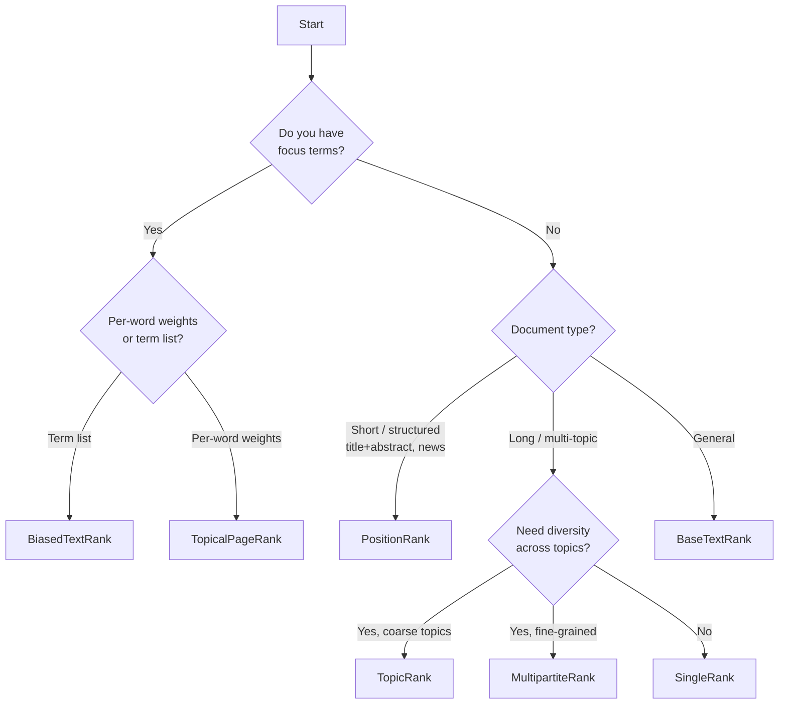

# Choosing a Variant

This page provides a decision guide to help you pick the right algorithm variant for your use case.

## Decision Flowchart

## Scenario Table

| Scenario | Recommended Variant | Why |
|---|---|---|
| Blog post keywords | [BaseTextRank](base-textrank.md) | General-purpose, no extra config needed |
| Academic paper abstract | [PositionRank](position-rank.md) | Key terms appear early |
| Security audit extraction | [BiasedTextRank](biased-textrank.md) | Steer toward specific domains |
| LDA-guided extraction | [TopicalPageRank](topical-pagerank.md) | Data-driven per-word weights |
| Multi-section report | [TopicRank](topic-rank.md) or [MultipartiteRank](multipartite-rank.md) | Ensure coverage across topics |
| Long technical document | [SingleRank](single-rank.md) | Cross-sentence windowing captures more co-occurrences |

## When in Doubt

Start with **BaseTextRank**. It requires no extra configuration, works well across a wide range of document types, and serves as a reliable baseline. Once you see how it performs on your data, you can switch to a more specialized variant:

- If important keywords are being missed because they appear only in later sections, try **SingleRank** (weighted edges and cross-sentence windowing help).
- If results are too generic and you know which domain you care about, try **BiasedTextRank** with a focus vocabulary.
- If the keyword list is dominated by a single theme in a multi-topic document, try **TopicRank** or **MultipartiteRank** to promote diversity.
- If you have numeric word-importance scores from a topic model or other source, try **TopicalPageRank**.
- If your documents are short and structured (abstracts, news leads), try **PositionRank** to leverage the early-position signal.
